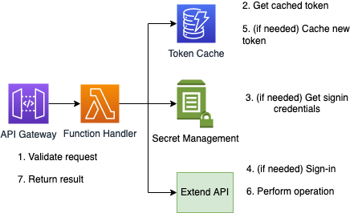

# Virtual Transaction Service API

This repository contains the code to create an API service that lists card transactions from [Extend](https://developer.paywithextend.com/). 

## Overview

### Operations
The API is defined in the project's `swagger.yaml` file. All operations are performed using HTTP GET. The following operations are defined:
* `/cards`: Lists the details of all virtual credit cards for the authenticated user.
* `/cards/active`: Lists the details of active virtual credit cards for the authenticated user (Extend status is "ACTIVE").
* `/cards/{cardId}`: Lists the details of a single virtual card, identified by its `cardId` (e.g. `vc_abc12345`)
* `/cards/{cardId}/transactions`: Lists the most recent 25 transactions for the given virtual card identified by its `cardId`. 
* `/transactions`: Lists the most recent 25 transactions for each card assigned to the authenticated user 

### Authentication
Requests must include an HTTP header called `token` with the value being an authentication token known to the service that identifies a user. This is currently hand-waved for the take-home assignment and a static value will be provided for demo purposes.

### Error handling
The API will return an HTTP status of 200 for successful requests, 401 for requests missing or containing an invalid authentication token, 404 for missing or invalid identifiers, and 500 for internal service errors. 

### Solution design
Requests are proxied through API Gateway to AWS Lambda. Each operation is backed by a dedicated lambda function. Lambda utilizes DynamoDB for caching user authentication tokens and SSM Parameter Store for secrets management. Below is a high-level architecture for the solution:



Requests are processed as follows: 

1. The API gateway receives the request and passes control to the appropriate lambda function handler. The function handler performs basic validation of the request inputs and marshals request parameters into a `VTSRequest` instance.
2. The lambda function passes control to `ExtendVTSService`, which handles a) Extend API communications via the `ExtendApiClient`; b) configuration management via the `ExtendSSMConfigClient`; and c) service authentication and credential caching through the `ExtendTokenDynamoDbCacheClient`. The service attempts to look up the cached Extend API service token for the authenticated user. 
3. If the token is in the cache, it retrieves the last refresh token value and mvoes to step 6. If the token is not in the cache, for the purposes of this demo it looks up the password for this demo account from the SSM Parameter Store service. 
4. The service uses `ExtendApiClient` to retrieve a new authorization token.
5. The service caches the new token in DynamoDB with a 10-minute TTL.
6. The service uses the `ExtendApiClient` to get a refreshed token for the requested operation. Results of the operation are marshalled into Python dataclass instances and returned to the `ExtendVTSService`.
7. Responses are serialized to JSON and returned to the client. If any exceptions are thrown, the `VTSService` encapsulates them into dedicated service exception types. 

## Pre-requisites
1. [AWS CLI](https://docs.aws.amazon.com/cli/latest/userguide/installing.html)
2. [AWS SAM](https://docs.aws.amazon.com/lambda/latest/dg/sam-cli-requirements.html)
3. `aws configure`

## Build/Deploy

To build and deploy you should run:

```
$ cd vts
$ sh ./deploy.sh
```

## Removal

To remove the packaging files and CloudFormation stack run:

```
$ cd vts
$ sh ./remove.sh
```

## Testing

Unit tests are defined in the `tests` folder in this project. Use PIP to install the test dependencies and run unit tests.

```
$ cd vts
$ pip install -r tests/requirements.txt --user
$ python -m pytest tests -v
```

You can also test locally using SAM to invoke the lambda functions directly. Example payloads are provided for GetAllCards and GetAllTransactions:

```
$ cd vts
$ sam local invoke -e src/events/getAllCards.json GetAllCardsFunction 
Invoking app.handlers.getAllCards.handler (python3.9)
Skip pulling image and use local one: public.ecr.aws/sam/emulation-python3.9:rapid-1.50.0-x86_64.

Mounting /Volumes/unix/workspace/vts/.aws-sam/build/GetAllCardsFunction as /var/task:ro,delegated inside runtime container
START RequestId: 02338a59-33c2-49a9-9215-e3a4184ef4f3 Version: $LATEST
{"statusCode": 200, "headers": {"Access-Control-Allow-Headers": "*", "Access-Control-Allow-Origin": "*", "Access-Control-Allow-Methods": "*", "Content-Type": "application/json"}, "body": "[{\"id\": \"vc_A681POqRINI7goyrCNPff7\", \"displayName\": \"Mark Setzer\", \"limitCents\": 5000, \"balanceCents\": 255, \"last4\": \"5348\", \"status\": \"ACTIVE\"}]"}
END RequestId: 02338a59-33c2-49a9-9215-e3a4184ef4f3
REPORT RequestId: 02338a59-33c2-49a9-9215-e3a4184ef4f3  Init Duration: 0.21 ms  Duration: 7361.22 ms    Billed Duration: 7362 ms        Memory Size: 128 MB     Max Memory Used: 128 MB
```

## Demo

For review purposes this project is currently live at: https://t56h273kv7.execute-api.us-east-1.amazonaws.com/Prod 

Here's an example of the GetActiveCards API:
```bash
$ curl https://t56h273kv7.execute-api.us-east-1.amazonaws.com/Prod/cards/active -H 'token: mark@setz.org' | jq .
[
  {
    "id": "vc_A681POqRINI7goyrCNPff7",
    "displayName": "Mark Setzer",
    "limitCents": 5000,
    "balanceCents": 255,
    "last4": "5348",
    "status": "ACTIVE"
  }
]
```

## Future improvements / feedback

I can think of many things to improve about this solution. In no particular order:
* Proper service authentication. A static header and storing passwords shouldn't be needed; for a "real" corporate customer I'd hope to offer federated/single sign-on options (perhaps through some combination of SAML and OAuth2 using Cognito).
* The Extend service authentication could be tightened up too. Right now it gets a new token for each operation and signs in every 10 minutes. The background refresh adds latency too. Once we move away from storing credentials I'd probably look to manage sessions for the user, perhaps proactively refreshing credentials so we don't need to take the latency hit on each request.
* Making HTTP calls from the handler lambdas isn't a great practice. It'd be better to queue the request and have another process push the result back, or put it somewhere the client could pick it up asynchronously, but this would complicate the client. For the take-home assignment I really wanted to stick with synchronous HTTP for simplicity. 
* Throttling. Extend's API is a dependency that a) I should scale to, and b) should probably throttle me if I go beyond some well-defined transaction volume. Lots of techniques possible for this but in generl I should try to be a well-behaved client while not expecting I will have well-behaved clients.
* Pagination. This isn't supported at all right now, but seems simple enough to add in `ExtendApiClient` and isn't really needed for our toy example.
* Better error handling. The `VTSService` and `ExtendApiClient` have shallow implementations and could throw more helpful exceptions/give better feedback.
* More tests. I wanted to show what I thought decent unit tests would look like, and with SAM we also have some black-box testing, but we're missing proper integration tests, end-to-end tests, and canary tests. 
* Operational dashboards. AWS is great at this; if this were a "real" service I'd probably hook up XRay, establish some monitors on basic availability metrics like requests/latency/errors, and alarm if they went over some threshold. For a service like this I'd almost certainly want dependency and client-specific metrics, especially if that list was relatively contained. 
* Better IaC. SAM builds the API gateway and wires up the lambdas. With something like CDK or Terraform we could represent the DynamoDB table, Parameter store and other infrastructure dependencies. 
* CI/CD. Ideally pushing a commit should rebuild and publish our updated code into a pipeline where we run automated tests, maybe replay some production traffic in a pre-production environment to see if we've regressed in any ways, and gradually roll out the new code with appropriate bake times and alarms to rollback automatically on failure.
* The solution is really a moonolith deployed five times (one for each Lambda), so any change to the package means CloudFormation is updating all the others right now. This can be solved by using Lambda layers and generally making the code more modular; having small independent functions would let us keep deployment sizes down and encourage better isolation if we decided to e.g. split some operations into services.
* Nitpicky but I'm not a huge fan of the lambda handlers re-assembling the dataclasses before serializing the final response. This was an annoying side-effect of using API Gateway, the proxy integration option with Lambda, and Python dataclasses, the latter of which isn't a first-class citizen yet with respect to Python's JSON library. I initially worked around this by providing my own JSON deserializer, but this led to API responses being string-escaped JSON and would have made clients unescape/deserialize, which didn't feel right.
